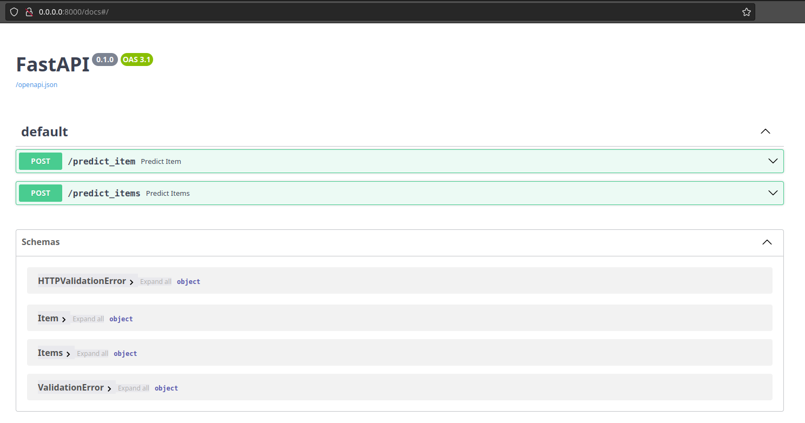
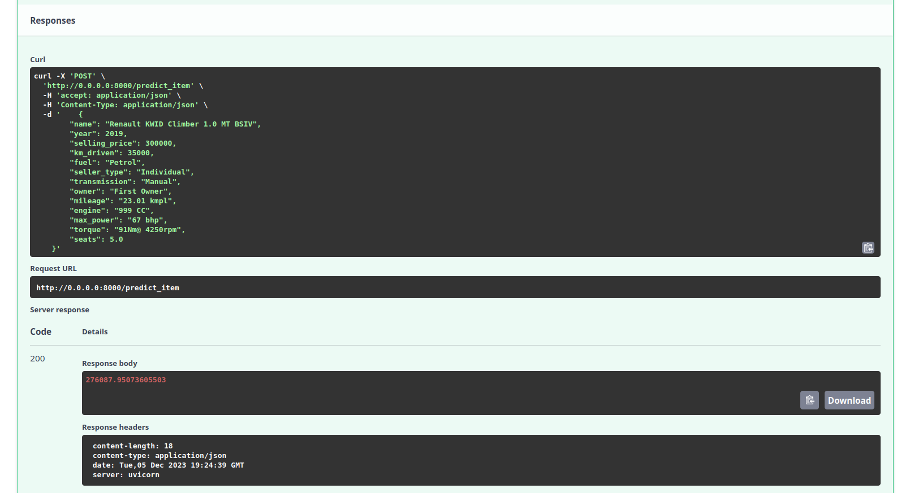
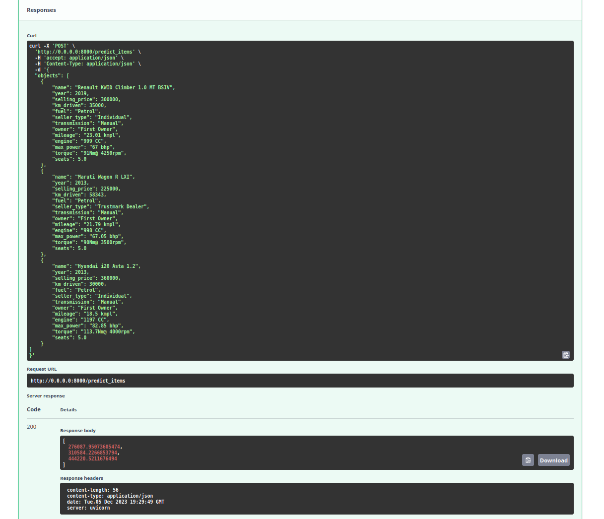

# ML ДЗ №1: предсказание стоимости автомобилей

## Часть 1-3: заполнение ноутбука с заданиями
Результаты выполнения заданий - в приложенном [файле](HW1_Regression_with_inference.ipynb).

## Часть 4
### Данные
Данные для обучения до предобработки выглядят следующим образом:

```
<class 'pandas.core.frame.DataFrame'>
RangeIndex: 6999 entries, 0 to 6998
Data columns (total 13 columns):
 #   Column         Non-Null Count  Dtype  
---  ------         --------------  -----  
 0   name           6999 non-null   object 
 1   year           6999 non-null   int64  
 2   selling_price  6999 non-null   int64  
 3   km_driven      6999 non-null   int64  
 4   fuel           6999 non-null   object 
 5   seller_type    6999 non-null   object 
 6   transmission   6999 non-null   object 
 7   owner          6999 non-null   object 
 8   mileage        6797 non-null   object 
 9   engine         6797 non-null   object 
 10  max_power      6803 non-null   object 
 11  torque         6796 non-null   object 
 12  seats          6797 non-null   float64
dtypes: float64(1), int64(3), object(9)
memory usage: 711.0+ KB
```

### Предобработка

#### Заполнение пропусков
В тренировочном датасете количество строк с пропусками сравнительно небольшое (менее 5%), в таких строках чаще всего отсутствует значительная доля численных параметров (`mileage`, `engine`, `max_power`, `seats`). Такие строки решено удалить из train-датасета. Для заполнения пропусков в тестовых данных использовал медианы по столбцам из train.

#### Преобразование типов
Из столбцов `engine`, `mileage`, `max_power` при помощи регулярного выражения извлечены численные значения и преобразованы к численным типам.

#### Feature engineering
На основании существующих в датасете столбцов были сформированы новые фичи:

- `maker`, `model` - извлечены из `name` путем применения метода `str.split(expand=True)` и использования первых двух столбцов результата
- `car_age`, `car_age_log` - получены из `year` путем вычитания максимального значения в датасете и взятия логарифма от результата
- `km_driven_log`, `mileage_log` - логарифмы соответствующих фич
- `max_power_x_engine`, `max_power_x_engine_log` - произведение `max_power * engine`, логарифм результата
- `car_age_log_x_km_driven_log`, `car_age_log_x_mileage_log` - аналогично `max_power_x_engine_log`, также добавлены их логарифмы

Столбцы `name`, `torque` удалены из датасета и не использутся в обучении напрямую.

#### Кодирование категориальных переменных
Для кодирования столбцов `"fuel", "seller_type", "transmission", "owner", "seats", "maker", "model"` использован `OneHotEncoder` с удалением первого столбца во избежание мультиколлинеарности.

#### Стандартизирование численных переменных
Численные переменные стандартизированы с использованием `StandartScaler`.

### Обучение модели и результаты
#### Модель
На обработанных данных была обучена гребневая (ridge) регрессия - линейная модель с L2-регуляризацией. Для подбора параметра регуляризации `alpha` использован поиск по сетке `GridSearchCV` на пространстве `np.logspace(-1, 3, 30)`. В результате получено значение `alpha = 0.489`.

#### Качество
Для обученной модели были посчитаны метрики качества `R2` и `MSE`:

```
{
    'train': 
        {
            'R2': 0.9071528962119457, 
            'MSE': 26455905480.496983},
    'test': 
        {
            'R2': 0.9298492474144803, 
            'MSE': 40324655785.68418
        }
}
```

#### Анализ модели
В ходе выполнения заданий ноутбука для лучшей модели было получено `R2=0.645` на `test`.
В результате feature engineering удалось значительно повысить качество модели. 

Различными манипуляциями над численными признаками удавалось незначительно повысить метрику `R2` вплоть до значений в районе `0.7`. Из полезных улучшений можно отметить: добавление логарифмических и комбинированных признаков, кодирование `seats` в категориальный признак, удаление из трейна строк с большим количеством пропущенных значений.

Наибольший прирост удалось получить после добавления категориальных признаков `maker` и `model`, которые и дали буст до полученных в итоге значений `R2`. По-видимому, информация о производителе и модели автомобиля вносит значительный вклад в оценку ее стоимости.

В результирующей обученной модели не был использован признак `torque`, поскольку для его использования требуется нетривиальная обработка с извлечением численных значений из строки и переводом между разными единицами измерения, в результате часть данных из исходного датасета теряется. Корректная обработка этого признака может привести к дополнительному улучшению качества (впрочем, по моим ожиданиям, не очень значительному.)

### Часть 5: Реализация сервиса на FastAPI
Обученная в предыдущем шаге модель была использована для реализации на FastAPI сервиса предсказания стоимости автомобилей. Скриншоты работы сервиса приведены ниже:





